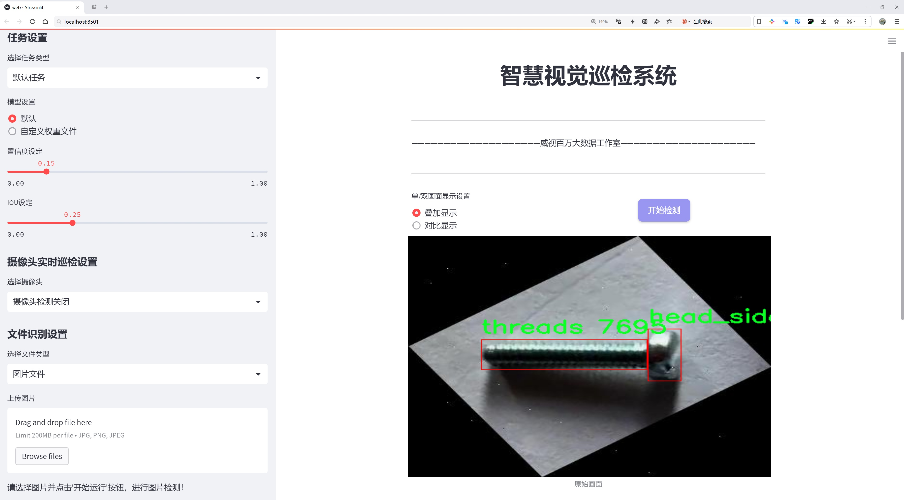
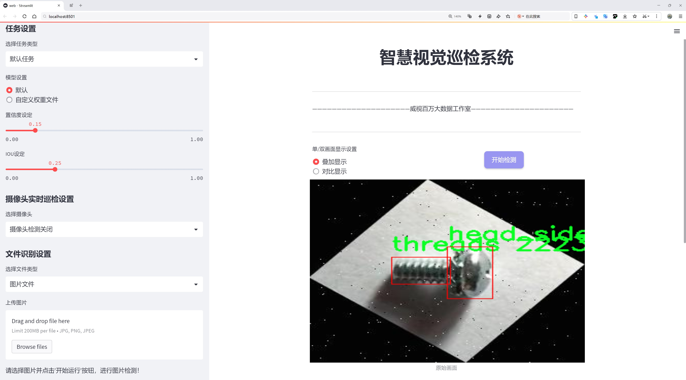
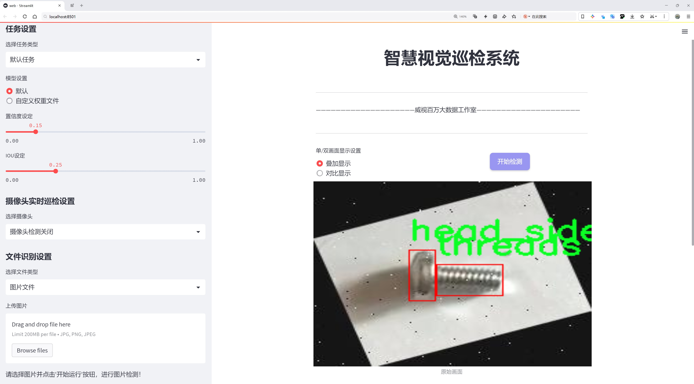
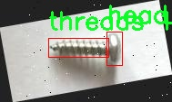
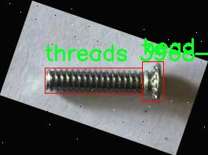
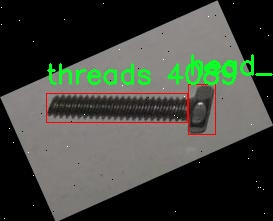
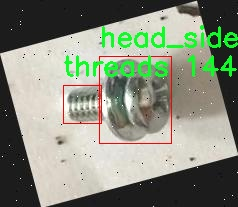
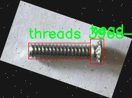

# 螺丝头与螺杆检测检测系统源码分享
 # [一条龙教学YOLOV8标注好的数据集一键训练_70+全套改进创新点发刊_Web前端展示]

### 1.研究背景与意义

项目参考[AAAI Association for the Advancement of Artificial Intelligence](https://gitee.com/qunmasj/projects)

项目来源[AACV Association for the Advancement of Computer Vision](https://kdocs.cn/l/cszuIiCKVNis)

研究背景与意义

随着工业自动化和智能制造的快速发展，螺丝作为连接和固定零部件的重要元件，其检测与识别技术逐渐受到广泛关注。螺丝头与螺杆的精准检测不仅关系到产品的质量控制，还直接影响到生产效率和安全性。传统的人工检测方法不仅效率低下，而且容易受到人为因素的影响，导致误判和漏判。因此，基于计算机视觉的自动化检测系统应运而生，成为提高生产线智能化水平的重要手段。

在众多计算机视觉技术中，YOLO（You Only Look Once）系列模型因其高效的实时目标检测能力而备受青睐。YOLOv8作为该系列的最新版本，具备更强的特征提取能力和更快的推理速度，适合于复杂环境下的目标检测任务。然而，针对螺丝头与螺杆的检测，现有的YOLOv8模型仍存在一定的局限性，如对不同视角、不同光照条件下的螺丝形态的适应性不足。因此，改进YOLOv8模型以提高其在螺丝检测任务中的性能，具有重要的理论和实践意义。

本研究所使用的数据集包含4000张图像，涵盖了四个类别，包括螺丝头的侧视图、螺丝顶部视图以及螺纹部分。这些图像的多样性为模型的训练提供了丰富的样本，有助于提升模型的泛化能力和鲁棒性。通过对这些图像进行标注和分类，研究将构建一个高效的螺丝检测系统，能够在实际生产环境中快速、准确地识别和定位螺丝部件。这一系统的实现，不仅能够显著提高生产效率，降低人工成本，还能在质量控制方面发挥重要作用，确保产品的一致性和可靠性。

此外，基于改进YOLOv8的螺丝检测系统还具有广泛的应用前景。随着智能制造的不断推进，自动化检测技术将在更多领域得到应用，如汽车制造、电子产品组装、机械设备维护等。通过本研究的深入探索，可以为其他类似的目标检测任务提供借鉴，推动计算机视觉技术在工业领域的进一步发展。

综上所述，基于改进YOLOv8的螺丝头与螺杆检测系统的研究，不仅具有重要的学术价值，也为实际生产提供了切实可行的解决方案。通过优化目标检测模型，提升其在特定应用场景下的性能，将为实现智能制造的目标贡献一份力量。

### 2.图片演示







##### 注意：由于此博客编辑较早，上面“2.图片演示”和“3.视频演示”展示的系统图片或者视频可能为老版本，新版本在老版本的基础上升级如下：（实际效果以升级的新版本为准）

  （1）适配了YOLOV8的“目标检测”模型和“实例分割”模型，通过加载相应的权重（.pt）文件即可自适应加载模型。

  （2）支持“图片识别”、“视频识别”、“摄像头实时识别”三种识别模式。

  （3）支持“图片识别”、“视频识别”、“摄像头实时识别”三种识别结果保存导出，解决手动导出（容易卡顿出现爆内存）存在的问题，识别完自动保存结果并导出到tempDir中。

  （4）支持Web前端系统中的标题、背景图等自定义修改，后面提供修改教程。

  另外本项目提供训练的数据集和训练教程,暂不提供权重文件（best.pt）,需要您按照教程进行训练后实现图片演示和Web前端界面演示的效果。

### 3.视频演示

[3.1 视频演示](https://www.bilibili.com/video/BV1TSs8eEEPW/)

### 4.数据集信息展示

##### 4.1 本项目数据集详细数据（类别数＆类别名）

nc: 3
names: ['head_side_view', 'screw-top-view', 'threads']


##### 4.2 本项目数据集信息介绍

数据集信息展示

在本研究中，我们采用了名为“Screw Head, Body detection”的数据集，以改进YOLOv8模型在螺丝头与螺杆检测系统中的表现。该数据集专门针对螺丝的不同视角和特征进行了精心设计，包含了三种主要类别，分别是“head_side_view”（螺丝头侧视图）、“screw-top-view”（螺丝顶部视图）和“threads”（螺纹）。这些类别的选择不仅反映了螺丝在实际应用中的多样性，也为模型的训练提供了丰富的样本，确保其在不同场景下的泛化能力。

首先，数据集中的“head_side_view”类别包含了大量螺丝头的侧面图像，这些图像展示了螺丝头的形状、大小和特征。通过对这一类别的深入学习，YOLOv8模型能够有效识别出螺丝头的不同形态，进而提高其在实际应用中的检测精度。侧视图的图像能够帮助模型理解螺丝头的几何特征，为后续的螺杆检测奠定基础。

其次，“screw-top-view”类别则提供了螺丝顶部的视角，展示了螺丝的顶面特征。这一视角对于识别螺丝的类型和用途至关重要，因为不同类型的螺丝在顶面设计上往往存在显著差异。通过对这一类别的图像进行分析，模型能够学习到如何从顶部视角准确识别螺丝的种类，从而在工业自动化和机器人抓取等应用中发挥重要作用。

最后，“threads”类别专注于螺纹部分的检测。螺纹是螺丝的关键特征之一，其形状和排列方式直接影响螺丝的功能和性能。通过对螺纹图像的训练，YOLOv8模型能够掌握螺纹的细微差别，进而提高其在复杂环境中的检测能力。这一类别的图像通常具有较高的复杂性，因此为模型的训练提供了极具挑战性的样本，有助于提升其鲁棒性。

整体而言，“Screw Head, Body detection”数据集的设计充分考虑了螺丝在实际应用中的多样性和复杂性。通过对三种类别的系统学习，YOLOv8模型能够在不同的视角和特征下进行有效的检测，从而实现更高的准确率和更快的响应速度。这种针对性的训练数据不仅提高了模型的性能，也为后续的应用提供了坚实的基础。通过不断优化数据集和训练策略，我们期望能够在螺丝检测领域取得突破性进展，为工业自动化和智能制造提供更为高效的解决方案。











### 5.全套项目环境部署视频教程（零基础手把手教学）

[5.1 环境部署教程链接（零基础手把手教学）](https://www.ixigua.com/7404473917358506534?logTag=c807d0cbc21c0ef59de5)


[5.2 安装Python虚拟环境创建和依赖库安装视频教程链接（零基础手把手教学）](https://www.ixigua.com/7404474678003106304?logTag=1f1041108cd1f708b01a)

### 6.手把手YOLOV8训练视频教程（零基础小白有手就能学会）

[6.1 手把手YOLOV8训练视频教程（零基础小白有手就能学会）](https://www.ixigua.com/7404477157818401292?logTag=d31a2dfd1983c9668658)

### 7.70+种全套YOLOV8创新点代码加载调参视频教程（一键加载写好的改进模型的配置文件）

[7.1 70+种全套YOLOV8创新点代码加载调参视频教程（一键加载写好的改进模型的配置文件）](https://www.ixigua.com/7404478314661806627?logTag=29066f8288e3f4eea3a4)

### 8.70+种全套YOLOV8创新点原理讲解（非科班也可以轻松写刊发刊，V10版本正在科研待更新）

由于篇幅限制，每个创新点的具体原理讲解就不一一展开，具体见下列网址中的创新点对应子项目的技术原理博客网址【Blog】：


[8.1 70+种全套YOLOV8创新点原理讲解链接](https://gitee.com/qunmasj/good)

### 9.系统功能展示（检测对象为举例，实际内容以本项目数据集为准）

图9.1.系统支持检测结果表格显示

  图9.2.系统支持置信度和IOU阈值手动调节

  图9.3.系统支持自定义加载权重文件best.pt(需要你通过步骤5中训练获得)

  图9.4.系统支持摄像头实时识别

  图9.5.系统支持图片识别

  图9.6.系统支持视频识别

  图9.7.系统支持识别结果文件自动保存

  图9.8.系统支持Excel导出检测结果数据


### 10.原始YOLOV8算法原理

原始YOLOv8算法原理

YOLOv8算法是基于YOLOv5的最新进化版本，代表了目标检测领域的一次重要技术突破。它在设计上充分考虑了模型的轻量化与高效性，采用了多种创新的网络结构和优化策略，使得其在保持高精度的同时，显著提高了运算速度和实时性。YOLOv8的架构主要由三个部分组成：骨干特征提取网络、特征融合层和检测头层，这些部分的优化与改进是YOLOv8算法的核心。

在骨干特征提取网络中，YOLOv8引入了C2F模块，替代了YOLOv5中的C3模块。C2F模块的设计灵感来源于YOLOv7的ELAN思想，具有更高的灵活性和效率。C2F模块通过将特征图分为两个分支进行处理，第一条分支直接进行特征的连接，而第二条分支则通过多个Bottleneck网络进行串并联输出。这种设计不仅增强了梯度流的信息传递，还提高了特征的重用能力，解决了深层网络中常见的梯度消失问题。通过这种方式，YOLOv8能够有效提取目标的局部特征和全局特征，从而提升目标检测的精度。

特征融合层是YOLOv8的另一大亮点，采用了PAN-FPN（Path Aggregation Network - Feature Pyramid Network）结构，旨在实现多尺度特征的高效融合。该结构通过自下而上的方式，将高层特征与中层和浅层特征进行深度融合，确保了不同尺度特征之间的信息流动和共享。YOLOv8在这一部分的创新之处在于引入了BiFPN（Bidirectional Feature Pyramid Network），通过高效的双向跨尺度连接和加权特征融合，进一步提升了对不同尺度特征信息的提取速度。这种设计使得YOLOv8在处理复杂场景时，能够更好地捕捉到小目标和大目标的特征，显著提高了检测的鲁棒性。

在检测头层，YOLOv8采用了Anchor-Free的检测方式，取代了传统的Anchor-Based方法。这一转变使得模型在目标检测时不再依赖于预定义的锚框，从而减少了模型的复杂性和计算负担。YOLOv8的检测头使用了解耦头结构，分别处理目标的分类和边框回归任务，这种解耦设计使得模型在分类和回归上都能独立优化，进一步提升了检测精度。此外，YOLOv8还引入了VFLLoss和CIoULoss作为损失函数，以应对目标检测中的样本不平衡问题，尤其是在处理小目标时，这种损失函数的使用有效提高了模型的学习效率和收敛速度。

在数据预处理方面，YOLOv8继承了YOLOv5的策略，采用了多种数据增强手段，如马赛克增强、混合增强、空间扰动和颜色扰动等。这些增强手段的引入，旨在提高模型的泛化能力，使其在不同场景下都能保持良好的检测性能。通过将输入图像转换为640x640的RGB图像，YOLOv8能够充分利用其网络结构进行高效的特征提取和目标检测。

YOLOv8的设计不仅关注模型的精度和速度，还充分考虑了实际应用中的计算资源限制。轻量化的YOLOv8n版本在保持高性能的同时，显著降低了模型的计算复杂度，使得其能够在边缘设备上高效运行。这一特性使得YOLOv8在智能监控、自动驾驶、无人机等应用场景中展现出极大的潜力。

总的来说，YOLOv8算法通过一系列创新的设计和优化，成功地将目标检测的性能提升到了一个新的高度。其在骨干网络、特征融合层和检测头层的改进，使得YOLOv8不仅在精度上表现出色，同时在实时性和计算效率上也具备了极大的优势。这些特性使得YOLOv8成为当前目标检测领域的一项重要技术进展，推动了相关应用的发展与落地。随着YOLOv8的不断完善与推广，我们有理由相信，它将在未来的计算机视觉任务中发挥更为重要的作用。


### 11.项目核心源码讲解（再也不用担心看不懂代码逻辑）

#### 11.1 code\ultralytics\solutions\__init__.py

根据您的要求，我将对提供的代码进行分析和注释。由于您只提供了一个注释行 `# Ultralytics YOLO 🚀, AGPL-3.0 license`，我将对这个注释进行解释和分析。

```python
# Ultralytics YOLO 🚀, AGPL-3.0 license
```

### 代码分析

1. **Ultralytics YOLO**:
   - 这是一个深度学习目标检测模型的名称，YOLO（You Only Look Once）是一种实时目标检测系统，能够在图像中快速识别和定位多个对象。
   - Ultralytics 是一个团队或组织，专注于开发和维护 YOLO 模型的实现，提供了高效的代码和预训练模型。

2. **🚀**:
   - 这个表情符号通常用来表示快速、前进或与技术相关的进步。在这里，它可能暗示 YOLO 模型的高效性和快速性能。

3. **AGPL-3.0 license**:
   - 这是一个开源许可证，全称为 GNU Affero General Public License v3.0。它允许用户自由使用、修改和分发软件，但要求任何基于该软件的修改或扩展也必须以相同的许可证发布。
   - 这意味着如果你使用或修改了 Ultralytics YOLO 的代码，并将其用于商业或非商业目的，你必须公开你的源代码，并且以 AGPL-3.0 许可证的方式分享。

### 总结

该行代码的核心内容是对 Ultralytics YOLO 模型的声明，表明其开源性质和许可证要求。对于开发者来说，理解这些信息非常重要，因为它们涉及到使用和分发代码的法律责任和权利。

如果您有其他具体的代码文件需要分析，请提供相应的代码内容，我将为您进行详细的分析和注释。

这个文件是Ultralytics YOLO项目的一部分，文件名为`__init__.py`，它的主要作用是将包含在`code/ultralytics/solutions`目录中的Python文件标识为一个包。根据文件中的注释，Ultralytics YOLO是一个计算机视觉领域的项目，专注于目标检测任务，采用了YOLO（You Only Look Once）算法。注释中提到的AGPL-3.0许可证说明该项目是开源的，用户可以自由使用、修改和分发代码，但需要遵循该许可证的条款。

虽然文件内容非常简单，仅包含一行注释，但它在Python包的结构中起着重要的作用。通过将该目录标识为一个包，用户可以在其他Python文件中导入该包中的模块和功能。这种结构使得代码的组织更加清晰，并便于模块化开发。

总的来说，这个`__init__.py`文件虽然内容简单，但在整个项目中起到了关键的作用，确保了代码的可重用性和模块化。

#### 11.2 70+种YOLOv8算法改进源码大全和调试加载训练教程（非必要）\ultralytics\nn\extra_modules\ops_dcnv3\modules\dcnv3.py

以下是代码中最核心的部分，并附上详细的中文注释：

```python
import torch
from torch import nn
import torch.nn.functional as F

class DCNv3(nn.Module):
    def __init__(self,
                 channels=64,
                 kernel_size=3,
                 stride=1,
                 pad=1,
                 dilation=1,
                 group=4,
                 offset_scale=1.0,
                 center_feature_scale=False,
                 remove_center=False):
        """
        DCNv3模块的初始化函数
        :param channels: 输入和输出的通道数
        :param kernel_size: 卷积核的大小
        :param stride: 卷积的步幅
        :param pad: 卷积的填充
        :param dilation: 卷积的扩张
        :param group: 分组卷积的组数
        :param offset_scale: 偏移量的缩放因子
        :param center_feature_scale: 是否使用中心特征缩放
        :param remove_center: 是否移除中心点
        """
        super().__init__()
        # 检查通道数是否能被组数整除
        if channels % group != 0:
            raise ValueError(f'channels must be divisible by group, but got {channels} and {group}')
        
        self.channels = channels
        self.kernel_size = kernel_size
        self.stride = stride
        self.dilation = dilation
        self.pad = pad
        self.group = group
        self.group_channels = channels // group
        self.offset_scale = offset_scale
        self.center_feature_scale = center_feature_scale
        self.remove_center = int(remove_center)

        # 初始化卷积层、偏移量和掩码的线性层
        self.dw_conv = nn.Conv2d(channels, channels, kernel_size, stride=1, padding=pad, groups=channels)
        self.offset = nn.Linear(channels, group * (kernel_size * kernel_size - remove_center) * 2)
        self.mask = nn.Linear(channels, group * (kernel_size * kernel_size - remove_center))
        self.input_proj = nn.Linear(channels, channels)
        self.output_proj = nn.Linear(channels, channels)
        self._reset_parameters()  # 重置参数

    def _reset_parameters(self):
        """重置模型参数"""
        nn.init.constant_(self.offset.weight.data, 0.)
        nn.init.constant_(self.offset.bias.data, 0.)
        nn.init.constant_(self.mask.weight.data, 0.)
        nn.init.constant_(self.mask.bias.data, 0.)
        nn.init.xavier_uniform_(self.input_proj.weight.data)
        nn.init.constant_(self.input_proj.bias.data, 0.)
        nn.init.xavier_uniform_(self.output_proj.weight.data)
        nn.init.constant_(self.output_proj.bias.data, 0.)

    def forward(self, input):
        """
        前向传播函数
        :param input: 输入张量，形状为 (N, H, W, C)
        :return: 输出张量，形状为 (N, H, W, C)
        """
        N, H, W, _ = input.shape  # 获取输入的形状

        x = self.input_proj(input)  # 投影输入
        x_proj = x  # 保存投影后的输入以便后续使用

        x1 = input.permute(0, 3, 1, 2)  # 调整输入张量的维度顺序
        x1 = self.dw_conv(x1)  # 深度卷积
        offset = self.offset(x1)  # 计算偏移量
        mask = self.mask(x1).reshape(N, H, W, self.group, -1)  # 计算掩码并调整形状
        mask = F.softmax(mask, -1)  # 对掩码进行softmax处理

        # 使用DCNv3函数进行卷积操作
        x = DCNv3Function.apply(
            x, offset, mask,
            self.kernel_size, self.kernel_size,
            self.stride, self.stride,
            self.pad, self.pad,
            self.dilation, self.dilation,
            self.group, self.group_channels,
            self.offset_scale,
            256,
            self.remove_center)

        x = self.output_proj(x)  # 最后进行输出投影
        return x  # 返回输出
```

### 代码说明：
1. **DCNv3类**：这是一个深度可分离卷积模块的实现，包含了初始化和前向传播的逻辑。
2. **初始化函数**：设置卷积参数，检查通道数是否能被组数整除，并初始化各个层。
3. **_reset_parameters函数**：重置各个层的参数，使用常数初始化和Xavier均匀分布初始化。
4. **forward函数**：实现前向传播，处理输入数据，计算偏移量和掩码，并调用自定义的DCNv3函数进行卷积操作，最后返回输出结果。

这个程序文件是一个实现了DCNv3（Deformable Convolutional Networks v3）模块的PyTorch代码，主要用于计算机视觉任务中的卷积操作。文件中包含了多个类和函数，用于构建和使用DCNv3模块。

首先，文件开头的版权信息和许可证声明表明了该代码的来源和使用条款。接下来，导入了一些必要的库，包括PyTorch和相关的神经网络模块。

在代码中，`to_channels_first`和`to_channels_last`类用于在输入数据的通道格式（channels first和channels last）之间进行转换。这在处理不同格式的数据时非常有用。

`build_norm_layer`函数用于构建归一化层，支持批归一化（Batch Normalization）和层归一化（Layer Normalization），并根据输入和输出格式进行相应的转换。

`build_act_layer`函数用于构建激活函数层，支持ReLU、SiLU和GELU等激活函数。

`_is_power_of_2`函数用于检查一个数是否是2的幂，这在某些计算中是有用的，尤其是在优化性能时。

`CenterFeatureScaleModule`类实现了一个中心特征缩放模块，用于在DCNv3中进行特征缩放。

`DCNv3_pytorch`类是DCNv3模块的主要实现。它的构造函数接收多个参数，包括通道数、卷积核大小、步幅、填充、扩张率、分组数等。构造函数中还初始化了各个层，包括深度卷积、偏移量和掩码的线性层等，并设置了参数的初始值。

`_reset_parameters`方法用于重置模型参数，确保它们在训练开始时处于合适的状态。

`forward`方法定义了DCNv3模块的前向传播过程。它接收输入数据，经过一系列的线性变换、深度卷积和偏移量计算，最终输出经过处理的特征图。

`DCNv3`类是DCNv3模块的另一种实现，使用了不同的卷积方式（使用自定义的Conv类）。它的构造函数和前向传播方法与`DCNv3_pytorch`类类似，但在实现细节上有所不同。

`DCNv3_DyHead`类是DCNv3模块的动态头实现，主要用于处理特定的输入和输出格式，适用于一些特定的任务。

整体来看，这个文件实现了DCNv3模块的核心功能，提供了灵活的参数设置和多种功能模块，适合在深度学习模型中进行特征提取和处理。通过使用这些模块，用户可以构建更复杂的神经网络架构，以提高计算机视觉任务的性能。

#### 11.3 ui.py

```python
import sys
import subprocess

def run_script(script_path):
    """
    使用当前 Python 环境运行指定的脚本。

    Args:
        script_path (str): 要运行的脚本路径

    Returns:
        None
    """
    # 获取当前 Python 解释器的路径
    python_path = sys.executable

    # 构建运行命令，使用 streamlit 运行指定的脚本
    command = f'"{python_path}" -m streamlit run "{script_path}"'

    # 执行命令
    result = subprocess.run(command, shell=True)
    # 检查命令执行的返回码，若不为0则表示出错
    if result.returncode != 0:
        print("脚本运行出错。")


# 主程序入口
if __name__ == "__main__":
    # 指定要运行的脚本路径
    script_path = "web.py"  # 这里可以直接指定脚本名称

    # 调用函数运行脚本
    run_script(script_path)
```

### 代码注释说明：
1. **导入模块**：
   - `sys`：用于访问与 Python 解释器相关的变量和函数。
   - `subprocess`：用于执行外部命令。

2. **定义 `run_script` 函数**：
   - 该函数接收一个脚本路径作为参数，并使用当前 Python 环境运行该脚本。
   - 使用 `sys.executable` 获取当前 Python 解释器的路径，以确保使用正确的 Python 环境。
   - 构建一个命令字符串，使用 `streamlit` 模块运行指定的脚本。
   - 使用 `subprocess.run` 执行构建的命令，并通过 `shell=True` 允许在 shell 中执行命令。
   - 检查命令的返回码，如果返回码不为0，表示脚本运行出错，打印错误信息。

3. **主程序入口**：
   - 使用 `if __name__ == "__main__":` 确保只有在直接运行该脚本时才会执行以下代码。
   - 指定要运行的脚本路径（这里为 `"web.py"`）。
   - 调用 `run_script` 函数，传入脚本路径以运行该脚本。

这个程序文件名为 `ui.py`，主要功能是通过当前的 Python 环境运行一个指定的脚本，具体是使用 Streamlit 框架来启动一个 Web 应用。

首先，程序导入了必要的模块，包括 `sys`、`os` 和 `subprocess`。其中，`sys` 模块用于访问与 Python 解释器相关的变量和函数，`os` 模块提供了与操作系统交互的功能，而 `subprocess` 模块则用于创建新进程、连接到它们的输入/输出/错误管道，并获取它们的返回码。此外，程序还从 `QtFusion.path` 模块中导入了 `abs_path` 函数，用于获取文件的绝对路径。

接下来，定义了一个名为 `run_script` 的函数，该函数接受一个参数 `script_path`，表示要运行的脚本的路径。在函数内部，首先获取当前 Python 解释器的路径，存储在 `python_path` 变量中。然后，构建一个命令字符串 `command`，该命令使用 `streamlit run` 来运行指定的脚本。这里使用了格式化字符串，以确保命令中的路径正确处理空格等特殊字符。

随后，使用 `subprocess.run` 方法执行构建好的命令。该方法的 `shell=True` 参数表示在一个新的 shell 中执行命令。执行完命令后，检查返回码 `result.returncode`，如果返回码不为 0，表示脚本运行出错，则打印出错信息。

在文件的最后部分，使用 `if __name__ == "__main__":` 来确保只有在直接运行该脚本时才会执行下面的代码。在这里，首先调用 `abs_path` 函数来获取名为 `web.py` 的脚本的绝对路径，并将其存储在 `script_path` 变量中。最后，调用 `run_script` 函数来运行这个脚本。

总体来说，这个程序的目的是提供一个简单的接口，通过命令行启动一个 Streamlit Web 应用，便于开发和测试。

#### 11.4 code\ultralytics\hub\utils.py

以下是代码中最核心的部分，并附上详细的中文注释：

```python
import requests
import threading
import time
from ultralytics.utils import LOGGER, SETTINGS, ENVIRONMENT, __version__

# 定义一个函数，用于发送带有进度条的HTTP请求
def requests_with_progress(method, url, **kwargs):
    """
    使用指定的方法和URL发送HTTP请求，并可选地显示进度条。

    参数:
        method (str): 要使用的HTTP方法（例如 'GET', 'POST'）。
        url (str): 要发送请求的URL。
        **kwargs (dict): 传递给底层 `requests.request` 函数的其他关键字参数。

    返回:
        (requests.Response): HTTP请求的响应对象。
    """
    progress = kwargs.pop("progress", False)  # 从kwargs中提取进度参数
    if not progress:
        return requests.request(method, url, **kwargs)  # 如果没有进度条，直接发送请求

    # 启用流式请求以便处理大文件
    response = requests.request(method, url, stream=True, **kwargs)
    total = int(response.headers.get("content-length", 0))  # 获取响应的总大小
    try:
        pbar = TQDM(total=total, unit="B", unit_scale=True, unit_divisor=1024)  # 初始化进度条
        for data in response.iter_content(chunk_size=1024):  # 按块读取内容
            pbar.update(len(data))  # 更新进度条
        pbar.close()  # 关闭进度条
    except requests.exceptions.ChunkedEncodingError:  # 捕获连接中断的异常
        response.close()  # 关闭响应
    return response  # 返回响应对象


# 定义一个函数，用于智能发送HTTP请求，支持重试机制
def smart_request(method, url, retry=3, timeout=30, thread=True, verbose=True, progress=False, **kwargs):
    """
    使用'requests'库发送HTTP请求，支持指数退避重试机制。

    参数:
        method (str): 请求使用的HTTP方法。
        url (str): 要发送请求的URL。
        retry (int, optional): 放弃之前尝试的重试次数。默认是3。
        timeout (int, optional): 超时秒数，超时后将放弃重试。默认是30。
        thread (bool, optional): 是否在单独的守护线程中执行请求。默认是True。
        verbose (bool, optional): 是否在控制台打印输出。默认是True。
        progress (bool, optional): 是否在请求期间显示进度条。默认是False。
        **kwargs (dict): 传递给请求函数的关键字参数。

    返回:
        (requests.Response): HTTP响应对象。如果请求在单独线程中执行，则返回None。
    """
    retry_codes = (408, 500)  # 仅对这些状态码进行重试

    @TryExcept(verbose=verbose)
    def func(func_method, func_url, **func_kwargs):
        """执行带有重试和超时的HTTP请求，支持进度跟踪。"""
        r = None  # 响应对象
        t0 = time.time()  # 记录开始时间
        for i in range(retry + 1):
            if (time.time() - t0) > timeout:  # 检查是否超时
                break
            r = requests_with_progress(func_method, func_url, **func_kwargs)  # 发送请求
            if r.status_code < 300:  # 状态码在2xx范围内，表示成功
                break
            # 处理错误信息
            try:
                m = r.json().get("message", "No JSON message.")
            except AttributeError:
                m = "Unable to read JSON."
            if i == 0:
                if r.status_code in retry_codes:
                    m += f" Retrying {retry}x for {timeout}s." if retry else ""
                if verbose:
                    LOGGER.warning(f"请求失败: {m} (状态码: {r.status_code})")
            time.sleep(2**i)  # 指数退避
        return r  # 返回响应对象

    args = method, url
    kwargs["progress"] = progress  # 添加进度参数
    if thread:
        threading.Thread(target=func, args=args, kwargs=kwargs, daemon=True).start()  # 在新线程中执行
    else:
        return func(*args, **kwargs)  # 在当前线程中执行


# 定义一个类，用于收集匿名事件分析
class Events:
    """
    用于收集匿名事件分析的类。事件分析在设置中启用sync=True时启用，sync=False时禁用。

    属性:
        url (str): 发送匿名事件的URL。
        rate_limit (float): 发送事件的速率限制（秒）。
        metadata (dict): 包含环境元数据的字典。
        enabled (bool): 根据某些条件启用或禁用事件。
    """

    url = "https://www.google-analytics.com/mp/collect?measurement_id=G-X8NCJYTQXM&api_secret=QLQrATrNSwGRFRLE-cbHJw"

    def __init__(self):
        """初始化Events对象，设置事件、速率限制和元数据的默认值。"""
        self.events = []  # 事件列表
        self.rate_limit = 60.0  # 速率限制（秒）
        self.t = 0.0  # 速率限制计时器（秒）
        self.metadata = {
            "cli": Path(sys.argv[0]).name == "yolo",
            "install": "git" if is_git_dir() else "pip" if is_pip_package() else "other",
            "python": ".".join(platform.python_version_tuple()[:2]),  # Python版本
            "version": __version__,
            "env": ENVIRONMENT,
            "session_id": round(random.random() * 1e15),  # 随机会话ID
            "engagement_time_msec": 1000,
        }
        self.enabled = (
            SETTINGS["sync"]
            and RANK in (-1, 0)
            and not TESTS_RUNNING
            and ONLINE
            and (is_pip_package() or get_git_origin_url() == "https://github.com/ultralytics/ultralytics.git")
        )

    def __call__(self, cfg):
        """
        尝试将新事件添加到事件列表，并在达到速率限制时发送事件。

        参数:
            cfg (IterableSimpleNamespace): 包含模式和任务信息的配置对象。
        """
        if not self.enabled:
            return  # 事件禁用，不执行任何操作

        # 尝试添加事件
        if len(self.events) < 25:  # 事件列表限制为25个事件
            params = {
                **self.metadata,
                "task": cfg.task,
                "model": cfg.model if cfg.model in GITHUB_ASSETS_NAMES else "custom",
            }
            if cfg.mode == "export":
                params["format"] = cfg.format
            self.events.append({"name": cfg.mode, "params": params})

        # 检查速率限制
        t = time.time()
        if (t - self.t) < self.rate_limit:
            return  # 在速率限制内，等待发送

        # 超过速率限制，立即发送
        data = {"client_id": SETTINGS["uuid"], "events": self.events}  # 客户端ID和事件列表

        # 发送POST请求
        smart_request("post", self.url, json=data, retry=0, verbose=False)

        # 重置事件和速率限制计时器
        self.events = []
        self.t = t


# 初始化事件对象
events = Events()
```

### 代码核心部分解释：
1. **requests_with_progress**：这个函数用于发送HTTP请求，并在下载时显示进度条。它处理大文件下载的流式请求，并在下载过程中更新进度条。

2. **smart_request**：这个函数实现了一个智能的HTTP请求机制，支持重试和超时功能。它可以在失败时自动重试，并根据状态码决定是否重试。

3. **Events类**：这个类用于收集和发送匿名事件分析数据。它在特定条件下启用，并根据配置收集事件数据，达到速率限制后发送数据。

这些核心部分实现了HTTP请求的灵活性和事件分析的功能，是整个代码的关键。

这个程序文件是 Ultralytics YOLO 项目中的一个工具模块，主要用于处理与 Ultralytics HUB 相关的请求和事件分析。文件中导入了多个库和工具函数，提供了 HTTP 请求的功能以及事件收集的机制。

首先，文件定义了一些常量，包括 HUB_API_ROOT 和 HUB_WEB_ROOT，这两个常量分别代表 Ultralytics HUB 的 API 和网页地址，可以通过环境变量进行配置。接着，定义了一个 `request_with_credentials` 函数，用于在 Google Colab 环境中进行 AJAX 请求。该函数会检查当前环境是否为 Colab，如果不是，则抛出异常。函数内部使用 JavaScript 创建一个 Promise 对象来处理请求，并返回请求的结果。

接下来，文件中定义了 `requests_with_progress` 函数，该函数用于执行 HTTP 请求，并在下载过程中显示进度条。函数根据传入的参数决定是否显示进度条，并在请求的响应中迭代读取数据，以更新进度条。

`smart_request` 函数是一个更为复杂的请求处理函数，支持重试机制和超时设置。它使用指数退避算法来处理请求失败的情况，并且可以选择在单独的线程中执行请求。函数内部会根据返回的状态码判断是否需要重试，并在达到重试次数或超时后返回最终的响应。

接下来是 `Events` 类，它用于收集匿名事件分析数据。该类在初始化时会设置事件的 URL、速率限制、元数据等信息，并根据特定条件决定是否启用事件收集。类的 `__call__` 方法尝试将新事件添加到事件列表中，并在达到速率限制时发送事件数据。事件数据通过 `smart_request` 函数以 POST 方式发送到 Google Analytics。

最后，文件在末尾创建了一个 `Events` 类的实例，以便在后续的代码中使用。整体来看，这个模块为 Ultralytics YOLO 提供了与网络请求和事件分析相关的功能，旨在提升用户体验和系统的可用性。

#### 11.5 code\ultralytics\nn\modules\conv.py

以下是经过简化和注释的核心代码部分：

```python
import torch
import torch.nn as nn
import math

def autopad(k, p=None, d=1):
    """自动计算填充以保持输出形状与输入相同。"""
    if d > 1:
        k = d * (k - 1) + 1 if isinstance(k, int) else [d * (x - 1) + 1 for x in k]  # 计算实际的卷积核大小
    if p is None:
        p = k // 2 if isinstance(k, int) else [x // 2 for x in k]  # 默认填充为卷积核大小的一半
    return p

class Conv(nn.Module):
    """标准卷积层，包含卷积、批归一化和激活函数。"""

    default_act = nn.SiLU()  # 默认激活函数为SiLU

    def __init__(self, c1, c2, k=1, s=1, p=None, g=1, d=1, act=True):
        """初始化卷积层。"""
        super().__init__()
        # 创建卷积层
        self.conv = nn.Conv2d(c1, c2, k, s, autopad(k, p, d), groups=g, dilation=d, bias=False)
        self.bn = nn.BatchNorm2d(c2)  # 批归一化层
        # 根据输入选择激活函数
        self.act = self.default_act if act is True else act if isinstance(act, nn.Module) else nn.Identity()

    def forward(self, x):
        """前向传播：应用卷积、批归一化和激活函数。"""
        return self.act(self.bn(self.conv(x)))

class DWConv(Conv):
    """深度可分离卷积。"""

    def __init__(self, c1, c2, k=1, s=1, d=1, act=True):
        """初始化深度可分离卷积层。"""
        super().__init__(c1, c2, k, s, g=math.gcd(c1, c2), d=d, act=act)

class ChannelAttention(nn.Module):
    """通道注意力模块。"""

    def __init__(self, channels: int) -> None:
        """初始化通道注意力模块。"""
        super().__init__()
        self.pool = nn.AdaptiveAvgPool2d(1)  # 自适应平均池化
        self.fc = nn.Conv2d(channels, channels, 1, 1, 0, bias=True)  # 1x1卷积
        self.act = nn.Sigmoid()  # Sigmoid激活函数

    def forward(self, x: torch.Tensor) -> torch.Tensor:
        """前向传播：应用通道注意力机制。"""
        return x * self.act(self.fc(self.pool(x)))  # 通过池化和卷积生成注意力权重并应用

class SpatialAttention(nn.Module):
    """空间注意力模块。"""

    def __init__(self, kernel_size=7):
        """初始化空间注意力模块。"""
        super().__init__()
        assert kernel_size in (3, 7), "kernel size must be 3 or 7"  # 验证卷积核大小
        padding = 3 if kernel_size == 7 else 1
        self.cv1 = nn.Conv2d(2, 1, kernel_size, padding=padding, bias=False)  # 卷积层
        self.act = nn.Sigmoid()  # Sigmoid激活函数

    def forward(self, x):
        """前向传播：应用空间注意力机制。"""
        # 计算通道均值和最大值，然后通过卷积生成注意力权重
        return x * self.act(self.cv1(torch.cat([torch.mean(x, 1, keepdim=True), torch.max(x, 1, keepdim=True)[0]], 1)))

class CBAM(nn.Module):
    """卷积块注意力模块。"""

    def __init__(self, c1, kernel_size=7):
        """初始化CBAM模块。"""
        super().__init__()
        self.channel_attention = ChannelAttention(c1)  # 初始化通道注意力
        self.spatial_attention = SpatialAttention(kernel_size)  # 初始化空间注意力

    def forward(self, x):
        """前向传播：依次应用通道和空间注意力。"""
        return self.spatial_attention(self.channel_attention(x))  # 先应用通道注意力，再应用空间注意力

class Concat(nn.Module):
    """在指定维度上连接多个张量。"""

    def __init__(self, dimension=1):
        """初始化连接模块。"""
        super().__init__()
        self.d = dimension  # 设置连接的维度

    def forward(self, x):
        """前向传播：连接输入的张量。"""
        return torch.cat(x, self.d)  # 沿指定维度连接张量
```

### 代码说明
1. **autopad**: 计算填充以保持卷积操作前后输出形状一致。
2. **Conv**: 标准卷积层，包含卷积、批归一化和激活函数。
3. **DWConv**: 深度可分离卷积，继承自Conv，适用于减少参数量和计算量。
4. **ChannelAttention**: 实现通道注意力机制，通过自适应平均池化和1x1卷积生成通道权重。
5. **SpatialAttention**: 实现空间注意力机制，通过计算通道的均值和最大值来生成空间权重。
6. **CBAM**: 结合通道和空间注意力的模块，先应用通道注意力，再应用空间注意力。
7. **Concat**: 用于在指定维度上连接多个张量的模块。

这个程序文件是一个实现卷积模块的代码，主要用于深度学习框架PyTorch中，特别是在Ultralytics YOLO（You Only Look Once）模型中。文件中定义了多个卷积相关的类和函数，这些类和函数可以用于构建神经网络的不同层。

首先，文件导入了必要的库，包括数学库、NumPy和PyTorch的神经网络模块。接着，定义了一个名为`autopad`的函数，用于自动计算卷积操作所需的填充，以确保输出的形状与输入的形状相同。这个函数根据给定的卷积核大小、填充和扩张率来计算填充的大小。

接下来，定义了多个卷积类。`Conv`类是一个标准的卷积层，包含卷积操作、批归一化和激活函数。它的构造函数接受多个参数，如输入通道数、输出通道数、卷积核大小、步幅、填充、分组和扩张率。`forward`方法定义了前向传播的过程，即对输入张量应用卷积、批归一化和激活函数。

`Conv2`类是一个简化的卷积模块，增加了一个1x1的卷积层，并在前向传播中将两个卷积的输出相加。`LightConv`类实现了一种轻量级卷积结构，包含两个卷积层。`DWConv`类实现了深度卷积，它通过将每个输入通道与其对应的输出通道进行卷积来减少计算量。

`DWConvTranspose2d`类实现了深度转置卷积，而`ConvTranspose`类则实现了转置卷积层，支持批归一化和激活函数。`Focus`类用于将空间信息聚焦到通道维度，`GhostConv`类实现了Ghost卷积，这是一种高效的卷积方法。

`RepConv`类实现了一种基本的重复卷积块，支持训练和推理状态，并且可以融合卷积层以减少计算量。`ChannelAttention`和`SpatialAttention`类分别实现了通道注意力和空间注意力机制，用于增强特征表示。`CBAM`类结合了通道和空间注意力，形成一个卷积块注意力模块。

最后，`Concat`类用于在指定维度上连接多个张量，常用于特征融合。

总体而言，这个文件实现了多种卷积操作和注意力机制，为构建高效的神经网络提供了基础组件。通过这些模块，用户可以灵活地设计和优化自己的深度学习模型。

#### 11.6 train.py

以下是经过简化并添加详细中文注释的核心代码部分：

```python
import random
import numpy as np
import torch.nn as nn
from ultralytics.data import build_dataloader, build_yolo_dataset
from ultralytics.engine.trainer import BaseTrainer
from ultralytics.models import yolo
from ultralytics.nn.tasks import DetectionModel
from ultralytics.utils import LOGGER, RANK
from ultralytics.utils.torch_utils import de_parallel, torch_distributed_zero_first

class DetectionTrainer(BaseTrainer):
    """
    扩展自 BaseTrainer 类的检测模型训练类。
    """

    def build_dataset(self, img_path, mode="train", batch=None):
        """
        构建 YOLO 数据集。

        参数:
            img_path (str): 包含图像的文件夹路径。
            mode (str): 模式，`train` 表示训练模式，`val` 表示验证模式。
            batch (int, optional): 批量大小，适用于 `rect` 模式。默认为 None。
        """
        gs = max(int(de_parallel(self.model).stride.max() if self.model else 0), 32)
        return build_yolo_dataset(self.args, img_path, batch, self.data, mode=mode, rect=mode == "val", stride=gs)

    def get_dataloader(self, dataset_path, batch_size=16, rank=0, mode="train"):
        """构造并返回数据加载器。"""
        assert mode in ["train", "val"]
        with torch_distributed_zero_first(rank):  # 仅在 DDP 中初始化数据集 *.cache 一次
            dataset = self.build_dataset(dataset_path, mode, batch_size)
        shuffle = mode == "train"  # 训练模式下打乱数据
        workers = self.args.workers if mode == "train" else self.args.workers * 2
        return build_dataloader(dataset, batch_size, workers, shuffle, rank)  # 返回数据加载器

    def preprocess_batch(self, batch):
        """对图像批次进行预处理，包括缩放和转换为浮点数。"""
        batch["img"] = batch["img"].to(self.device, non_blocking=True).float() / 255  # 将图像归一化到 [0, 1]
        if self.args.multi_scale:  # 如果启用多尺度训练
            imgs = batch["img"]
            sz = (
                random.randrange(self.args.imgsz * 0.5, self.args.imgsz * 1.5 + self.stride)
                // self.stride
                * self.stride
            )  # 随机选择新的尺寸
            sf = sz / max(imgs.shape[2:])  # 计算缩放因子
            if sf != 1:
                ns = [
                    math.ceil(x * sf / self.stride) * self.stride for x in imgs.shape[2:]
                ]  # 计算新的形状
                imgs = nn.functional.interpolate(imgs, size=ns, mode="bilinear", align_corners=False)  # 进行插值缩放
            batch["img"] = imgs
        return batch

    def get_model(self, cfg=None, weights=None, verbose=True):
        """返回 YOLO 检测模型。"""
        model = DetectionModel(cfg, nc=self.data["nc"], verbose=verbose and RANK == -1)
        if weights:
            model.load(weights)  # 加载权重
        return model

    def plot_training_samples(self, batch, ni):
        """绘制带有注释的训练样本。"""
        plot_images(
            images=batch["img"],
            batch_idx=batch["batch_idx"],
            cls=batch["cls"].squeeze(-1),
            bboxes=batch["bboxes"],
            paths=batch["im_file"],
            fname=self.save_dir / f"train_batch{ni}.jpg",
            on_plot=self.on_plot,
        )
```

### 代码说明：
1. **DetectionTrainer 类**：这是一个用于训练 YOLO 检测模型的类，继承自 `BaseTrainer`。
2. **build_dataset 方法**：构建数据集，接收图像路径、模式和批量大小，返回构建好的数据集。
3. **get_dataloader 方法**：构造数据加载器，确保在分布式训练中只初始化一次数据集。
4. **preprocess_batch 方法**：对输入的图像批次进行预处理，包括归一化和可能的缩放处理。
5. **get_model 方法**：返回一个 YOLO 检测模型，可以选择加载预训练权重。
6. **plot_training_samples 方法**：绘制训练样本及其注释，便于可视化训练过程中的数据。

这个程序文件 `train.py` 是一个用于训练 YOLO（You Only Look Once）目标检测模型的实现，基于 Ultralytics 提供的框架。程序的核心是 `DetectionTrainer` 类，它继承自 `BaseTrainer` 类，专门用于处理目标检测任务。

在文件开头，导入了一些必要的库和模块，包括数学运算、随机数生成、深度学习相关的 PyTorch 模块，以及 Ultralytics 提供的数据处理、模型构建和训练相关的工具。

`DetectionTrainer` 类的构造函数和方法定义了训练过程中的各个步骤。首先，`build_dataset` 方法用于构建 YOLO 数据集，接收图像路径、模式（训练或验证）和批量大小作为参数。该方法会根据模型的步幅计算出合适的图像尺寸，并调用 `build_yolo_dataset` 函数来创建数据集。

`get_dataloader` 方法则负责构建数据加载器，确保在分布式训练中只初始化一次数据集。它根据模式决定是否打乱数据，并设置工作线程的数量。

在 `preprocess_batch` 方法中，对每个批次的图像进行预处理，包括将图像缩放到合适的大小并转换为浮点数格式。这里还实现了多尺度训练的功能，通过随机选择图像尺寸来增强模型的鲁棒性。

`set_model_attributes` 方法用于设置模型的属性，包括类别数量和类别名称等，确保模型能够正确处理数据集中的类别信息。

`get_model` 方法返回一个 YOLO 检测模型，并可以加载预训练权重。`get_validator` 方法则返回一个用于模型验证的 `DetectionValidator` 实例。

`label_loss_items` 方法用于返回带有标签的训练损失项字典，这对于目标检测任务是必要的，因为需要跟踪不同类型的损失。

`progress_string` 方法生成一个格式化的字符串，用于显示训练进度，包括当前的 epoch、GPU 内存使用情况、损失值、实例数量和图像大小等信息。

`plot_training_samples` 方法用于绘制训练样本及其标注，帮助可视化训练过程中的数据。`plot_metrics` 和 `plot_training_labels` 方法则分别用于绘制训练过程中的指标和标签，便于分析模型的性能。

总体而言，这个程序文件提供了一个完整的训练框架，涵盖了数据集构建、数据加载、模型训练、损失计算和结果可视化等多个方面，旨在为用户提供一个高效的目标检测模型训练工具。

### 12.系统整体结构（节选）

### 整体功能和构架概括

Ultralytics YOLO 项目是一个用于目标检测和计算机视觉任务的深度学习框架，主要基于 YOLO（You Only Look Once）算法。该项目的架构模块化，包含多个功能文件，旨在提供高效的模型训练、推理和评估工具。以下是该项目的主要功能模块：

1. **模型定义与构建**：实现了不同类型的卷积层、注意力机制和特征提取模块，以支持多种 YOLO 变体。
2. **数据处理**：提供数据集构建、数据加载和预处理功能，确保训练和验证过程中数据的有效性。
3. **训练与验证**：实现了训练过程的管理，包括损失计算、进度显示和模型验证等。
4. **推理与预测**：支持对新数据进行推理和预测，提供结果可视化功能。
5. **工具与实用函数**：提供各种工具函数，支持 HTTP 请求、事件分析、模型导出等功能。

### 文件功能整理表

| 文件路径                                                                                     | 功能描述                                                                                     |
|----------------------------------------------------------------------------------------------|----------------------------------------------------------------------------------------------|
| `code/ultralytics/solutions/__init__.py`                                                    | 将目录标识为一个包，支持模块化开发。                                                          |
| `70+种YOLOv8算法改进源码大全和调试加载训练教程（非必要）/ultralytics/nn/extra_modules/ops_dcnv3/modules/dcnv3.py` | 实现 DCNv3 模块，支持可变形卷积操作，增强特征提取能力。                                     |
| `ui.py`                                                                                     | 提供一个接口，通过命令行启动 Streamlit Web 应用，便于开发和测试。                          |
| `code/ultralytics/hub/utils.py`                                                             | 提供与 Ultralytics HUB 相关的网络请求和事件分析功能。                                       |
| `code/ultralytics/nn/modules/conv.py`                                                      | 实现多种卷积层和注意力机制，为神经网络提供基础组件。                                         |
| `train.py`                                                                                  | 管理 YOLO 模型的训练过程，包括数据集构建、模型训练和损失计算等。                            |
| `code/ultralytics/engine/__init__.py`                                                      | 将引擎模块标识为一个包，支持模块化开发。                                                      |
| `code/ultralytics/data/dataset.py`                                                          | 定义数据集类，负责数据加载和预处理，支持训练和验证。                                        |
| `code/ultralytics/trackers/utils/__init__.py`                                              | 将跟踪器工具模块标识为一个包，支持模块化开发。                                              |
| `70+种YOLOv8算法改进源码大全和调试加载训练教程（非必要）/ultralytics/models/yolo/segment/predict.py` | 实现 YOLO 模型的分割任务推理功能。                                                            |
| `code/ultralytics/hub/__init__.py`                                                         | 将 HUB 模块标识为一个包，支持模块化开发。                                                    |
| `70+种YOLOv8算法改进源码大全和调试加载训练教程（非必要）/ultralytics/models/yolo/pose/val.py` | 实现 YOLO 模型的姿态估计任务验证功能。                                                        |
| `70+种YOLOv8算法改进源码大全和调试加载训练教程（非必要）/ultralytics/engine/exporter.py`  | 实现模型导出功能，支持将训练好的模型导出为不同格式以便于部署和使用。                        |

这个表格概述了每个文件的主要功能，展示了 Ultralytics YOLO 项目的模块化设计和功能分布。

注意：由于此博客编辑较早，上面“11.项目核心源码讲解（再也不用担心看不懂代码逻辑）”中部分代码可能会优化升级，仅供参考学习，完整“训练源码”、“Web前端界面”和“70+种创新点源码”以“13.完整训练+Web前端界面+70+种创新点源码、数据集获取”的内容为准。

### 13.完整训练+Web前端界面+70+种创新点源码、数据集获取


# [下载链接：https://mbd.pub/o/bread/ZpuZk59w](https://mbd.pub/o/bread/ZpuZk59w)